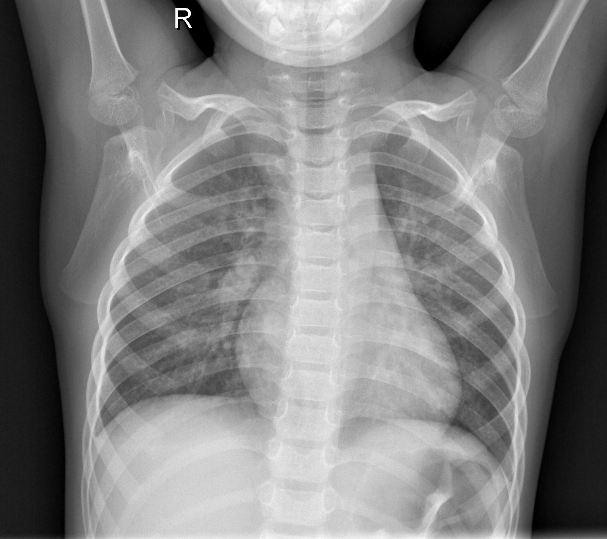

# Chest-X-Ray-Pneumonia-Detection

### Data Introduction
The dataset is taken from kaggle. 

There are two category in kaggle's data sets : Normal and PNEUMONIA.
Note: PNEUMONIA can also split into "virus" and "bacteria" class, but currently here I considered Normal & PNEUMONIA only.

  

